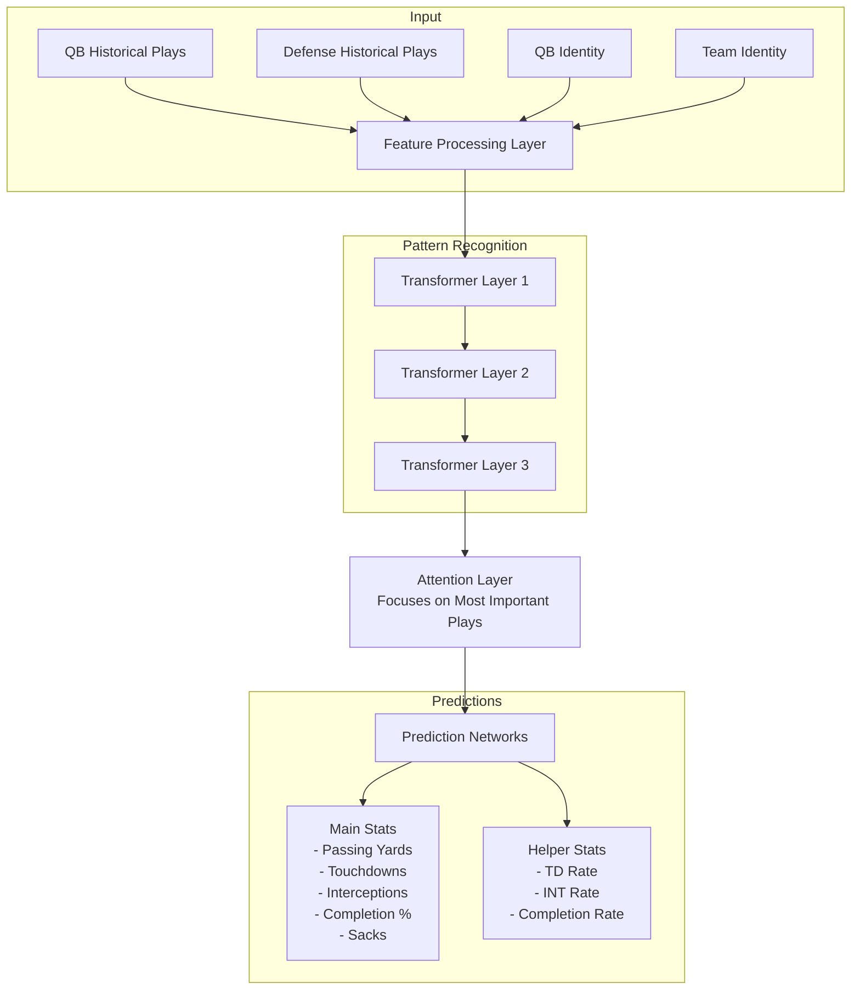

# QB Performance Predictor

## Overview
A deep learning sequence-to-regression model that predicts quarterback game-level statistics using historical play-by-play data. The model maps sequences of historical plays to continuous game-level statistical predictions using a transformer-based architecture.

## Model Type
- **Input**: Sequences of play-by-play data
- **Output**: 5 continuous regression predictions
  - Passing Yards (0 to 600)
  - Touchdowns (0 to 7)
  - Interceptions (0 to 5)
  - Completion Percentage (0 to 100)
  - Sacks (0 to 12)
- **Architecture**: Transformer-based sequence processor with regression heads
- **Loss**: MSE with focal loss modification for regression

## Key Features
- Predicts 5 key QB statistics:
  - Passing Yards
  - Touchdowns
  - Interceptions
  - Completion Percentage
  - Sacks
- Considers both QB and defensive team history
- Weights recent plays more heavily
- Learns QB and team-specific characteristics

## Model Architecture


## Advantages Over Other Approaches

### 1. Compared to Simple Statistical Models
- Captures complex patterns in play sequences
- Learns QB-specific and defense-specific characteristics
- Adapts to changing performance trends
- Considers full context of historical plays

### 2. Compared to Play-by-Play Simulation
- More computationally efficient
- Less prone to compounding errors
- Directly predicts game-level outcomes
- Doesn't require modeling every game situation

### 3. Compared to Traditional Machine Learning
- Handles variable-length sequences naturally
- No manual feature engineering required
- Learns hierarchical patterns automatically
- Better at capturing temporal relationships

### 4. Compared to Pure Box Score Models
- Uses richer play-by-play information
- Captures situational context
- Considers defensive matchups
- More granular understanding of performance

## Technical Highlights

### 1. Sequence Processing
- Transformer encoder architecture
- Multi-head attention mechanism
- Learnable positional encodings
- Recent play weighting

### 2. Identity Learning
- Learned QB embeddings
- Learned team embeddings
- Captures playing style and tendencies

### 3. Training Approach
- Multi-task learning
- Auxiliary prediction tasks
- Focal loss for main predictions
- Curriculum learning with increasing sequence lengths

## Use Cases
1. **Game Planning**: Teams can analyze expected QB performance against specific defenses
2. **Player Evaluation**: Assess QB performance trends and matchup impacts
3. **Fantasy Sports**: Make informed decisions about QB starts/sits
4. **Sports Analytics**: Study QB-defense matchup dynamics

## Limitations
- Requires substantial historical play data
- Cannot account for unprecedented situations
- Limited by quality of input play-by-play data
- May not capture extreme game script changes

## Future Improvements
1. Add weather condition impacts
2. Include injury status information
3. Model drive-level momentum
4. Add confidence intervals to predictions
5. Incorporate more defensive metrics
6. More features!

## Requirements
- Python 3.8+
- PyTorch 1.8+
- pandas
- numpy
- scikit-learn

## Installation
```bash
pip install -r requirements.txt
```

## Usage Example
```python
from qb_predictor import QBPredictor

model = QBPredictor()

# Predict QB performance
predictions = model.predict_performance(
    qb_name="Patrick Mahomes",
    defense_team="Buffalo Bills"
)

print(predictions)
```