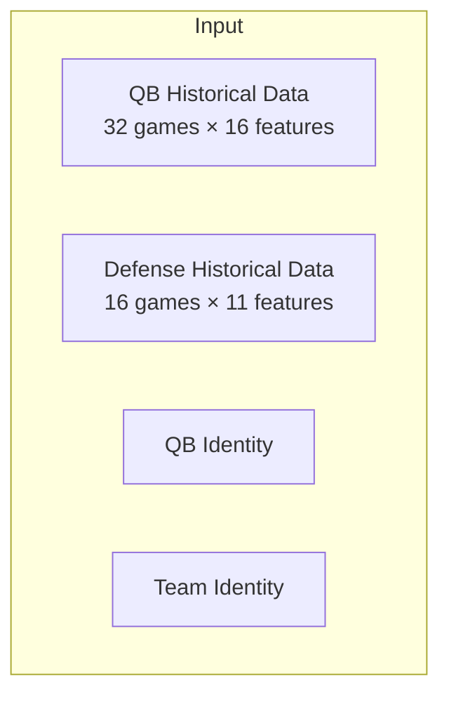
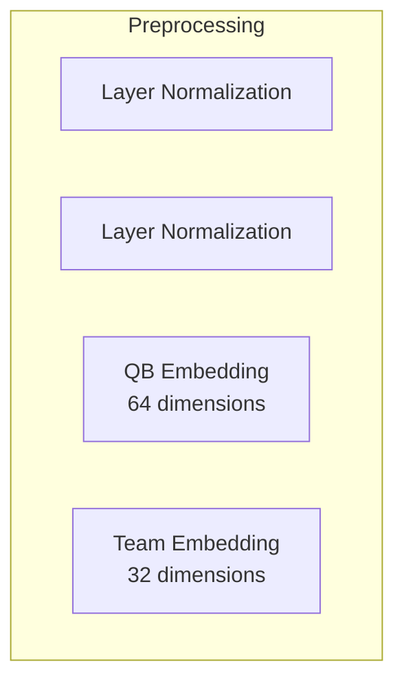
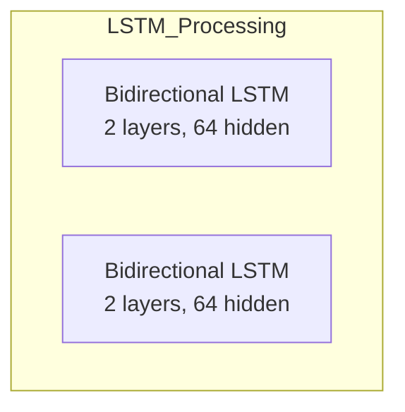
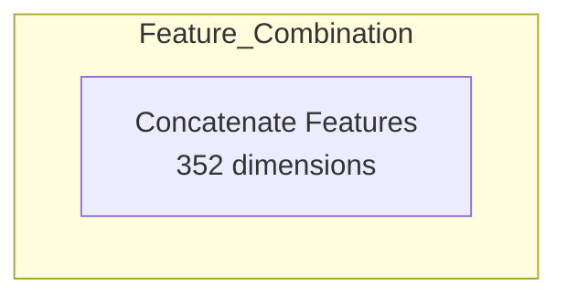
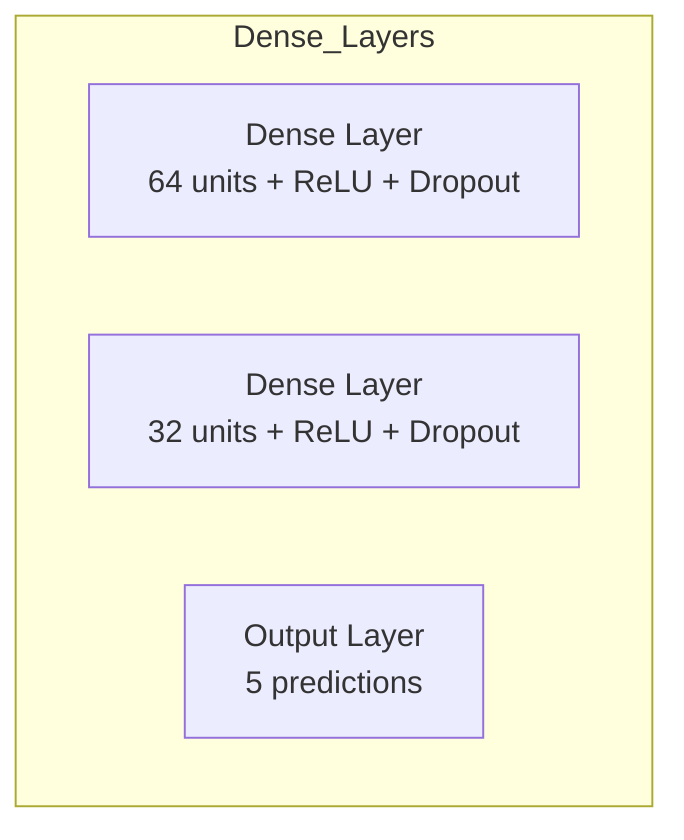
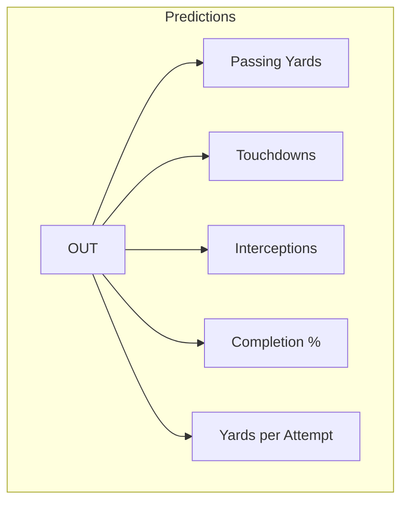

# Model Architecture Detailed Explanation

## 1. Input Section

**Technical Explanation**:
- **QB Historical Data**: 
  - 32 most recent games for each quarterback
  - 16 features per game including:
    - Basic stats (yards, TDs, attempts)
    - Pass distribution (short/deep, left/middle/right)
    - Efficiency metrics (completion %, YPA)
    - Protection metrics (sacks, hits)

- **Defense Historical Data**:
  - 16 most recent games for each defense
  - 11 features per game including:
    - Yards allowed
    - Pressure rates
    - Coverage statistics
    - Efficiency against pass

**Simple Explanation**:
Think of this like a scout's notebook containing:
- The QB's last 32 games (like watching their last two seasons)
- The defense's last 16 games (like studying their recent form)
- The QB's name (like knowing who you're scouting)
- The team's name (like knowing who they're playing against)

Just as a scout wouldn't only look at one game, we look at many games to understand patterns and tendencies.

## 2. Preprocessing Section

**Technical Explanation**:
- **Layer Normalization**:
  - Normalizes each sequence independently
  - Helps with training stability
  - Applied separately to QB and defense sequences

- **Embeddings**:
  - QB: 64-dimensional vector capturing QB characteristics
  - Team: 32-dimensional vector capturing team defensive style

**Simple Explanation**:
This is like:
- Converting all stats to a 0-100 scale so they're fair to compare (normalization)
- Creating a detailed "scouting report" for each QB and team (embeddings)
- Instead of just saying "This is Patrick Mahomes", we create a detailed profile of his playing style

## 3. LSTM Processing Section

**Technical Explanation**:
- **Bidirectional LSTM Layers**:
  - Process sequences in both directions
  - 2 stacked layers for deeper pattern learning
  - 64 hidden units per direction (128 total)

**Simple Explanation**:
Like having two expert scouts:
- One watches games from start to finish
- One watches games from most recent to oldest
- Both share their insights
- They look for both recent trends and long-term patterns
- They can spot if a QB is improving or if a defense is getting tired

## 4. Feature Combination Section

**Technical Explanation**:
- **Concatenation Layer**:
  - Combines all processed features:
    - QB LSTM output (128 dimensions)
    - Defense LSTM output (128 dimensions)
    - QB embedding (64 dimensions)
    - Team embedding (32 dimensions)

**Simple Explanation**:
Like a meeting where all scouts share their notes:
- QB performance scout shares their analysis
- Defense scout shares their findings
- QB style expert adds their knowledge
- Team expert provides their insights
All this information is combined into one big report.

## 5. Dense Layers Section

**Technical Explanation**:
- **First Dense Layer (FC1)**:
  - Reduces 352 dimensions to 64
  - ReLU activation
  - Dropout (0.2) for regularization

- **Second Dense Layer (FC2)**:
  - Further reduces to 32 dimensions
  - ReLU activation
  - Dropout (0.2) for regularization

**Simple Explanation**:
Like a series of analysts reviewing the scouting reports:
- First analyst combines all the raw information into key points
- Second analyst refines these points into clear trends
- Final analyst makes specific predictions
- They occasionally skip some information (dropout) to avoid over-focusing on any one detail

## 6. Predictions Section

**Technical Explanation**:
- **Five Key Predictions**:
  1. **Passing Yards**: Total passing yards
  2. **Touchdowns**: Expected passing TDs
  3. **Interceptions**: Expected INTs
  4. **Completion %**: Completion percentage
  5. **YPA**: Yards per attempt

**Simple Explanation**:
Like a final scouting report predicting:
- How many yards the QB will throw for
- How many touchdowns they might score
- How many times they might get intercepted
- What percentage of passes they'll complete
- How many yards they'll gain per throw

Just as a scout would give you specific predictions for the upcoming game, our model provides these five key statistics that tell the story of how the QB is likely to perform.

## Dimension Flow Summary
```
Input → Processing → Output
[32×16] QB sequence     → LSTM → [128]
[16×11] DEF sequence    → LSTM → [128]
[1] QB ID    → Embedding → [64]
[1] Team ID  → Embedding → [32]
                    ↓
Combined Features [352]
                    ↓
Dense Layer 1     [64]
                    ↓
Dense Layer 2     [32]
                    ↓
Output            [5]
```

**Simple Explanation**:
Think of it like a scouting department:
1. Gather lots of detailed information (Input)
2. Have experts analyze different aspects (Processing)
3. Combine all insights into one report (Combined Features)
4. Refine the report to key points (Dense Layers)
5. Make final predictions (Output)