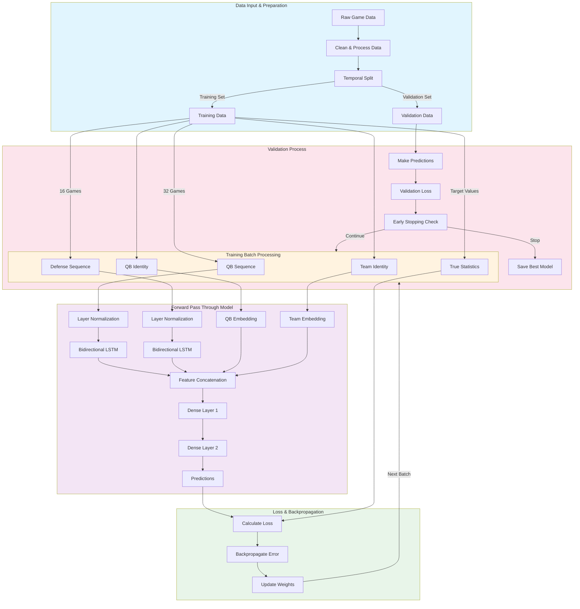

# Training Loop and Architecture Integration

## Section Explanations

### 1. Data Input & Preparation
**Technical**: 
- Temporal split maintains chronological order
- Training set: First 80% of games
- Validation set: Last 20% of games
- Features normalized to standard scale

**Simple**: 
Like organizing game films:
- Put older games in training set
- Save recent games for testing
- Make sure all stats use same scale

### 2. Training Batch Processing
**Technical**:
- Batch size: 16 samples
- Each sample contains:
  - 32-game QB sequence
  - 16-game defense sequence
  - QB/Team identifiers
  - Target statistics

**Simple**:
Like preparing a study session:
- Pull 16 different QB-vs-Defense matchups
- For each matchup, gather:
  - QB's last 32 games
  - Defense's last 16 games
  - Who's playing who
  - What actually happened

### 3. Forward Pass Through Model
**Technical**:
- Sequential processing through:
  - Normalization layers
  - Embedding lookups
  - LSTM processing
  - Feature concatenation
  - Dense layer transformation

**Simple**:
Like a scout's analysis process:
- Standardize all the numbers
- Look up player/team profiles
- Study game patterns
- Combine all information
- Refine into predictions

### 4. Loss & Backpropagation
**Technical**:
- Calculate MSE loss
- Compute gradients
- Update model weights
- Apply regularization

**Simple**:
Like a coach's feedback:
- See how far off predictions were
- Figure out why they were wrong
- Adjust the analysis process
- Avoid over-focusing on any one aspect

### 5. Validation Process
**Technical**:
- Evaluate on unseen data
- Track validation loss
- Implement early stopping
- Save best performing model

**Simple**:
Like testing the scouting system:
- Try predictions on new games
- See if accuracy is improving
- Stop if not getting better
- Keep best version of system

### Training Loop Flow
**Technical**:
1. Process batch of data
2. Make predictions
3. Calculate loss
4. Update weights
5. Validate periodically
6. Repeat or stop

**Simple**:
Like a continuous improvement cycle:
1. Study game films
2. Make predictions
3. Check accuracy
4. Adjust analysis
5. Test on new games
6. Keep going until no improvement